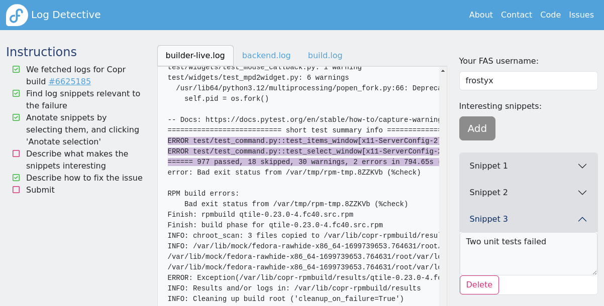

# Log Detective website

Production instance: http://log-detective.com

## Screenshot



## Development

Easily run on your machine:

```
docker-compose up -d
```

See README files for frontend and backend:

- [frontend](frontend/README.md)
- [backend](backend/README.md)

## Deployment

See [openshift/README](openshift/README.md)
